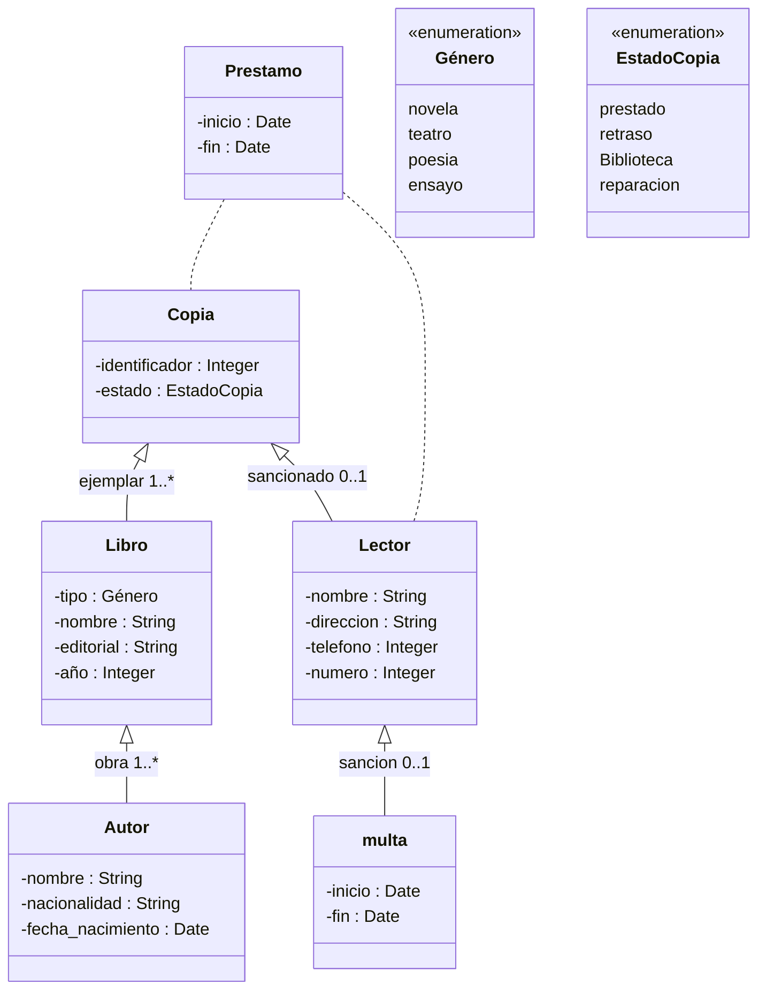

```mermaid

classDiagram

      Copia <|-- Libro :ejemplar 1..*
      Copia <|-- Lector : sancionado 0..1
      Libro <|-- Autor : obra 1..*
      Lector <|-- multa : sancion 0..1
      Prestamo .. Copia
      Prestamo .. Lector

      class Libro{
         -tipo : Género
         -nombre : String
         -editorial : String
         -año : Integer
      }

         class Autor{
          -nombre : String
          -nacionalidad : String
          -fecha_nacimiento : Date

      }

      class Copia{
         -identificador : Integer
         -estado : EstadoCopia
      }
      
      class Lector{
         -nombre : String
         -direccion : String
         -telefono : Integer
         -numero : Integer  
      }

      class Prestamo{
          -inicio : Date
          -fin : Date
      }
      
      class multa{
          -inicio : Date
          -fin : Date
      }

      class Género{
          <<enumeration>>
          novela
          teatro
          poesia
          ensayo
      }

      class EstadoCopia{
          <<enumeration>>
          prestado
          retraso
          Biblioteca
          reparacion
      }
```